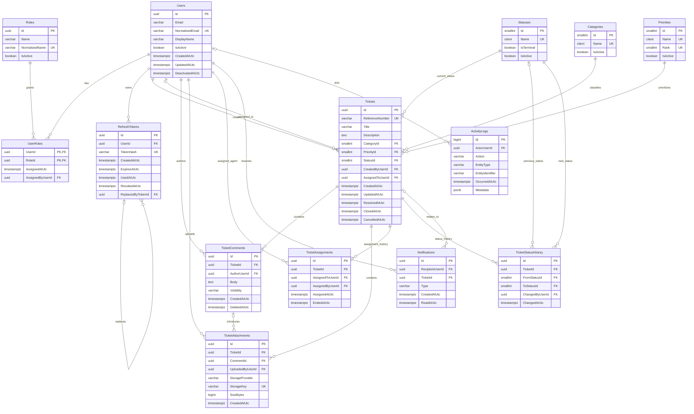

# IT Help Desk Database Design

## 1. System overview

This schema supports an enterprise IT help desk in which employees create tickets, support agents work and reassign them, managers oversee work, and administrators configure and audit the system. It separates current ticket state from append-oriented assignment, status, notification, and activity history.

The design is relational and targets PostgreSQL through Entity Framework Core. UUID (`uuid`) identifiers are used for users and main transactional records. Small generated integers (`smallint GENERATED BY DEFAULT AS IDENTITY`) are suggested for low-volume lookup values. Every timestamp representing an instant uses PostgreSQL `timestamptz` and must be written in UTC.

Database tables and columns use PascalCase to align with the .NET model. PostgreSQL therefore creates quoted, case-sensitive identifiers; handwritten SQL must use the exact casing and double quotes. No automatic snake_case convention is used.

Lookup names for categories, priorities, and statuses use PostgreSQL `citext`. Their ordinary unique indexes are consequently case-insensitive. `UpdatedAtUtc` has no database default because PostgreSQL would not update it automatically; future application logic or a save interceptor will maintain it.

`Users`, `Roles`, and `UserRoles` are implemented on ASP.NET Identity using GUID keys. `User` and `Role` extend the Identity types rather than creating competing stores, and Identity supplies account fields such as password hashes, security stamps, lockout state, phone data, and email-confirmation state. No plain-text or reversibly encrypted password belongs in this schema.

Identity persistence also adds `UserClaims`, `UserLogins`, `RoleClaims`, and `UserTokens`. These infrastructure tables use Identity's standard schemas and relationships with the approved non-`AspNet` table names. They support authentication infrastructure but do not imply that login endpoints, JWT issuance, or authorization policies have been implemented.

## 2. Table definitions

### Users

Future application users. Deactivation is preferred over deletion so ticket ownership and audit history remain intact.

| Column | PostgreSQL type | Nullability | Purpose |
|---|---|---|---|
| `Id` | `uuid` | Required | Primary key; generated by the application or database. |
| `Email` | `varchar(320)` | Required | User's contact and sign-in email. |
| `NormalizedEmail` | `varchar(320)` | Required | Canonical uppercase form used for case-insensitive uniqueness and future Identity compatibility. |
| `DisplayName` | `varchar(200)` | Required | Human-readable name shown in tickets and activity. |
| `IsActive` | `boolean` | Required | Whether the account may participate in the application; default `true`. |
| `CreatedAtUtc` | `timestamptz` | Required | UTC creation time; default `CURRENT_TIMESTAMP`. |
| `UpdatedAtUtc` | `timestamptz` | Required | UTC last-update time. |
| `DeactivatedAtUtc` | `timestamptz` | Nullable | UTC deactivation time; null while active. |

- Primary key: `PK_Users (Id)`.
- Unique constraint: `UQ_Users_NormalizedEmail (NormalizedEmail)`. This enforces case-insensitive email uniqueness independently of database collation.
- Recommended indexes: `IX_Users_IsActive (IsActive)` where `IsActive = true`; optional search index on `DisplayName` if directory search requires it.
- Checks: normalized email and display name must not be blank; `DeactivatedAtUtc` should be null when active.
- Future Identity fields such as `UserName`, password hash, security stamp, lockout, and concurrency stamp are intentionally deferred. Password hashes must be managed by ASP.NET Identity, never by custom plain-text fields.

### Roles

Named authorization roles. Roles are deactivated rather than removed after use.

| Column | PostgreSQL type | Nullability | Purpose |
|---|---|---|---|
| `Id` | `uuid` | Required | Primary key; compatible with a future GUID Identity role key. |
| `Name` | `varchar(100)` | Required | Display name of the role. |
| `NormalizedName` | `varchar(100)` | Required | Canonical uppercase name for uniqueness and Identity compatibility. |
| `Description` | `varchar(500)` | Nullable | Administrative explanation of the role. |
| `IsActive` | `boolean` | Required | Whether the role can be newly assigned; default `true`. |
| `CreatedAtUtc` | `timestamptz` | Required | UTC creation time. |
| `UpdatedAtUtc` | `timestamptz` | Required | UTC last-update time. |

- Primary key: `PK_Roles (Id)`.
- Unique constraint: `UQ_Roles_NormalizedName (NormalizedName)`.
- Recommended index: `IX_Roles_IsActive (IsActive)`.

### UserRoles

Many-to-many membership between users and roles, implemented as a custom `IdentityUserRole<Guid>` entity. It retains Identity's `UserId` and `RoleId` keys and adds assignment audit metadata. There is deliberately no `RoleId` column on `Users`.

| Column | PostgreSQL type | Nullability | Purpose |
|---|---|---|---|
| `UserId` | `uuid` | Required | User receiving the role. |
| `RoleId` | `uuid` | Required | Assigned role. |
| `AssignedAtUtc` | `timestamptz` | Required | UTC time the membership was created. |
| `AssignedByUserId` | `uuid` | Nullable | Administrator who assigned it; null for bootstrap or system assignment. |

- Primary key: composite `PK_UserRoles (UserId, RoleId)`; this also prevents duplicate membership.
- Foreign keys: `UserId -> Users.Id`, `RoleId -> Roles.Id`, and `AssignedByUserId -> Users.Id`.
- Recommended index: `IX_UserRoles_RoleId (RoleId)` for listing members of a role.

### RefreshTokens

Stores refresh-token lifecycle records associated with users. Plaintext refresh tokens are returned only at creation or rotation time and are never persisted; `TokenHash` contains the lowercase hexadecimal SHA-256 hash.

| Column | PostgreSQL type | Nullability | Purpose |
|---|---|---|---|
| `Id` | `uuid` | Required | Primary key generated by the application. |
| `UserId` | `uuid` | Required | User who owns the token. |
| `TokenHash` | `varchar(64)` | Required | Unique lowercase hexadecimal SHA-256 token hash. |
| `CreatedAtUtc` | `timestamptz` | Required | UTC creation time. |
| `ExpiresAtUtc` | `timestamptz` | Required | UTC expiration time. |
| `UsedAtUtc` | `timestamptz` | Nullable | UTC time the token was consumed during rotation. |
| `RevokedAtUtc` | `timestamptz` | Nullable | UTC revocation time. |
| `ReplacedByTokenId` | `uuid` | Nullable | Replacement token record in the rotation chain. |
| `CreatedByIpAddress` | `varchar(45)` | Nullable | Optional creation IP address. |
| `RevokedByIpAddress` | `varchar(45)` | Nullable | Optional revocation IP address. |
| `RevocationReason` | `varchar(500)` | Nullable | Non-secret revocation context. |

- Primary key: `PK_RefreshTokens (Id)`.
- Foreign keys: `UserId -> Users.Id` and `ReplacedByTokenId -> RefreshTokens.Id`, both with `RESTRICT` deletion.
- Unique constraint: `TokenHash`.
- Recommended indexes: user/expiry, user/creation, active user/expiry, and filtered replacement lookup.
- Rotation is single-use. Reuse of an already rotated token revokes the user's currently active refresh tokens and records a non-secret reason.

### Categories

Configurable ticket classification values.

| Column | PostgreSQL type | Nullability | Purpose |
|---|---|---|---|
| `Id` | `smallint GENERATED BY DEFAULT AS IDENTITY` | Required | Primary key. |
| `Name` | `citext` (maximum length 100) | Required | Case-insensitive category name. |
| `Description` | `varchar(500)` | Nullable | Administrative description. |
| `SortOrder` | `smallint` | Required | Stable UI ordering; default `0`. |
| `IsActive` | `boolean` | Required | Whether new tickets may select the category; default `true`. |
| `CreatedAtUtc` | `timestamptz` | Required | UTC creation time. |
| `UpdatedAtUtc` | `timestamptz` | Required | UTC last-update time. |

- Primary key: `PK_Categories (Id)`.
- Unique constraint: ordinary unique index on the `citext` `Name` column, providing case-insensitive uniqueness.
- Recommended index: `IX_Categories_ActiveSort (IsActive, SortOrder)`.
- Referenced values must be deactivated, not deleted or renamed in a way that changes historical meaning.

### Priorities

Configurable urgency values with an explicit rank.

| Column | PostgreSQL type | Nullability | Purpose |
|---|---|---|---|
| `Id` | `smallint GENERATED BY DEFAULT AS IDENTITY` | Required | Primary key. |
| `Name` | `citext` (maximum length 50) | Required | Case-insensitive priority name. |
| `Rank` | `smallint` | Required | Relative urgency; larger values indicate greater urgency. |
| `Description` | `varchar(500)` | Nullable | Administrative meaning or response expectation. |
| `IsActive` | `boolean` | Required | Whether the priority is selectable; default `true`. |
| `CreatedAtUtc` | `timestamptz` | Required | UTC creation time. |
| `UpdatedAtUtc` | `timestamptz` | Required | UTC last-update time. |

- Primary key: `PK_Priorities (Id)`.
- Unique constraints: ordinary unique index on the `citext` `Name` column and `UQ_Priorities_Rank (Rank)`.
- Recommended index: `IX_Priorities_IsActive (IsActive)`.
- Check: `Rank > 0`.

### Statuses

Configurable workflow states. Workflow transition rules belong in a future application policy, not duplicated in ticket rows.

| Column | PostgreSQL type | Nullability | Purpose |
|---|---|---|---|
| `Id` | `smallint GENERATED BY DEFAULT AS IDENTITY` | Required | Primary key. |
| `Name` | `citext` (maximum length 50) | Required | Case-insensitive status name. |
| `Description` | `varchar(500)` | Nullable | Administrative meaning. |
| `SortOrder` | `smallint` | Required | Stable display ordering. |
| `IsTerminal` | `boolean` | Required | Whether the status normally ends active work; default `false`. |
| `IsActive` | `boolean` | Required | Whether future transitions may select it; default `true`. |
| `CreatedAtUtc` | `timestamptz` | Required | UTC creation time. |
| `UpdatedAtUtc` | `timestamptz` | Required | UTC last-update time. |

- Primary key: `PK_Statuses (Id)`.
- Unique constraint: ordinary unique index on the `citext` `Name` column.
- Recommended index: `IX_Statuses_ActiveSort (IsActive, SortOrder)`.

### Tickets

The current ticket snapshot. Assignment and status history are retained separately.

| Column | PostgreSQL type | Nullability | Purpose |
|---|---|---|---|
| `Id` | `uuid` | Required | Primary key. |
| `ReferenceNumber` | `varchar(30)` | Required | Unique, stable, human-readable identifier such as `HD-2026-000001`. |
| `Title` | `varchar(250)` | Required | Concise issue summary. |
| `Description` | `text` | Required | Initial problem or request description. |
| `CategoryId` | `smallint` | Required | Current category. |
| `PriorityId` | `smallint` | Required | Current priority. |
| `StatusId` | `smallint` | Required | Current workflow status. |
| `CreatedByUserId` | `uuid` | Required | User who opened the ticket. |
| `AssignedToUserId` | `uuid` | Nullable | Current support agent; null while unassigned. |
| `CreatedAtUtc` | `timestamptz` | Required | UTC creation time. |
| `UpdatedAtUtc` | `timestamptz` | Required | UTC last material update time. |
| `ResolvedAtUtc` | `timestamptz` | Nullable | First/current UTC resolution time, depending on approved reopen policy. |
| `ClosedAtUtc` | `timestamptz` | Nullable | UTC time the ticket entered `Closed`. |
| `CancelledAtUtc` | `timestamptz` | Nullable | UTC cancellation time when cancellation is approved and used. |

- Primary key: `PK_Tickets (Id)`.
- Foreign keys: `CategoryId -> Categories.Id`, `PriorityId -> Priorities.Id`, `StatusId -> Statuses.Id`, `CreatedByUserId -> Users.Id`, `AssignedToUserId -> Users.Id`.
- Unique constraint: `UQ_Tickets_ReferenceNumber (ReferenceNumber)`.
- Recommended indexes:
  - `IX_Tickets_StatusPriorityCreated (StatusId, PriorityId, CreatedAtUtc DESC)` for work queues.
  - `IX_Tickets_AssigneeStatus (AssignedToUserId, StatusId, UpdatedAtUtc DESC)` where `AssignedToUserId IS NOT NULL`.
  - `IX_Tickets_CreatorCreated (CreatedByUserId, CreatedAtUtc DESC)`.
  - `IX_Tickets_CategoryCreated (CategoryId, CreatedAtUtc DESC)`.
- Checks: title, description, and reference number must not be blank; terminal timestamps cannot precede `CreatedAtUtc`; `ClosedAtUtc` should not precede `ResolvedAtUtc` when both exist.
- `AssignedToUserId` is a deliberate current-state projection. Its value must agree with the one active `TicketAssignments` record, maintained transactionally by future application logic.

#### Cancellation decision

Cancellation should eventually be represented by both a `Cancelled` status and `CancelledAtUtc`: the status supplies workflow semantics and filtering, while the timestamp provides an exact audit/reporting instant. `Cancelled` is intentionally excluded from the initial migration seed set, and `CancelledAtUtc` remains reserved and unused. Tickets must not simulate cancellation by silently overloading `Closed`. A future approved workflow must add the terminal status and record each transition in status history.

### TicketComments

Conversation entries and internal support notes.

| Column | PostgreSQL type | Nullability | Purpose |
|---|---|---|---|
| `Id` | `uuid` | Required | Primary key. |
| `TicketId` | `uuid` | Required | Parent ticket. |
| `AuthorUserId` | `uuid` | Required | User who authored the comment. |
| `Body` | `text` | Required | Comment content. |
| `Visibility` | `varchar(20)` | Required | `Public` or `Internal`; default `Public`. |
| `CreatedAtUtc` | `timestamptz` | Required | UTC creation time. |
| `UpdatedAtUtc` | `timestamptz` | Nullable | UTC edit time; null if never edited. |
| `DeletedAtUtc` | `timestamptz` | Nullable | Soft-deletion time while preserving the audit record. |

- Primary key: `PK_TicketComments (Id)`.
- Foreign keys: `TicketId -> Tickets.Id`, `AuthorUserId -> Users.Id`.
- Check constraints: `Visibility IN ('Public', 'Internal')`; body must not be blank.
- Recommended indexes: `IX_TicketComments_TicketCreated (TicketId, CreatedAtUtc)` and a partial internal-note index on `(TicketId, CreatedAtUtc)` where `Visibility = 'Internal'` if support-note queries warrant it.
- Authorization must exclude `Internal` comments from employee-facing queries, APIs, notification text, exports, and search indexes. The database marker supports this rule but does not replace API authorization.

### TicketAttachments

Metadata for externally stored files. Binary content is not stored in `Tickets` or this table.

| Column | PostgreSQL type | Nullability | Purpose |
|---|---|---|---|
| `Id` | `uuid` | Required | Primary key. |
| `TicketId` | `uuid` | Required | Ticket owning the attachment. |
| `CommentId` | `uuid` | Nullable | Comment that introduced the file, if applicable. |
| `UploadedByUserId` | `uuid` | Required | Uploading user. |
| `OriginalFileName` | `varchar(255)` | Required | Sanitized display filename supplied by the client. |
| `ContentType` | `varchar(150)` | Required | Validated media type. |
| `SizeBytes` | `bigint` | Required | File size for limits and reporting. |
| `StorageProvider` | `varchar(50)` | Required | Storage backend identifier, such as `Local`, `S3`, or `AzureBlob`. |
| `StorageKey` | `varchar(1024)` | Required | Opaque storage location/key; never a public authorization bypass URL. |
| `ContentHash` | `varchar(128)` | Nullable | Optional digest for integrity or deduplication. |
| `CreatedAtUtc` | `timestamptz` | Required | UTC upload metadata creation time. |
| `DeletedAtUtc` | `timestamptz` | Nullable | Soft-deletion time; physical object cleanup may be asynchronous. |

- Primary key: `PK_TicketAttachments (Id)`.
- Foreign keys: `TicketId -> Tickets.Id`, `CommentId -> TicketComments.Id`, `UploadedByUserId -> Users.Id`.
- Unique constraint: `UQ_TicketAttachments_StorageLocation (StorageProvider, StorageKey)`.
- Recommended indexes: `IX_TicketAttachments_TicketCreated (TicketId, CreatedAtUtc)` and `IX_TicketAttachments_CommentId (CommentId)` where non-null.
- Checks: `SizeBytes >= 0`; required strings must not be blank. If `CommentId` is supplied, application validation must ensure the comment belongs to the same ticket.

### TicketAssignments

Append-oriented assignment periods. An assignment ends when the ticket is reassigned or unassigned.

| Column | PostgreSQL type | Nullability | Purpose |
|---|---|---|---|
| `Id` | `uuid` | Required | Primary key. |
| `TicketId` | `uuid` | Required | Assigned ticket. |
| `AssignedToUserId` | `uuid` | Required | Support agent receiving the assignment. |
| `AssignedByUserId` | `uuid` | Nullable | Actor making the assignment; null for a system action. |
| `AssignedAtUtc` | `timestamptz` | Required | UTC start of the assignment. |
| `EndedAtUtc` | `timestamptz` | Nullable | UTC end; null identifies the active assignment. |
| `EndedByUserId` | `uuid` | Nullable | Actor ending the assignment; null for a system action or active row. |
| `Reason` | `varchar(500)` | Nullable | Optional reassignment context. |

- Primary key: `PK_TicketAssignments (Id)`.
- Foreign keys: `TicketId -> Tickets.Id`, assignee/actor columns -> `Users.Id`.
- Unique partial index: `UQ_TicketAssignments_OneActivePerTicket (TicketId) WHERE EndedAtUtc IS NULL`.
- Recommended indexes: `IX_TicketAssignments_TicketAssigned (TicketId, AssignedAtUtc DESC)` and `IX_TicketAssignments_AssigneeAssigned (AssignedToUserId, AssignedAtUtc DESC)`.
- Check: `EndedAtUtc IS NULL OR EndedAtUtc >= AssignedAtUtc`; `EndedByUserId` should be null while active.

### TicketStatusHistory

Immutable record of ticket status transitions.

| Column | PostgreSQL type | Nullability | Purpose |
|---|---|---|---|
| `Id` | `uuid` | Required | Primary key. |
| `TicketId` | `uuid` | Required | Ticket whose state changed. |
| `FromStatusId` | `smallint` | Nullable | Previous status; null for the initial creation event. |
| `ToStatusId` | `smallint` | Required | New status. |
| `ChangedByUserId` | `uuid` | Nullable | Human actor; null for a system transition. |
| `ChangedAtUtc` | `timestamptz` | Required | UTC transition time. |
| `Reason` | `varchar(1000)` | Nullable | Optional explanation or resolution context. |

- Primary key: `PK_TicketStatusHistory (Id)`.
- Foreign keys: `TicketId -> Tickets.Id`, status columns -> `Statuses.Id`, `ChangedByUserId -> Users.Id`.
- Recommended indexes: `IX_TicketStatusHistory_TicketChanged (TicketId, ChangedAtUtc DESC)` and `IX_TicketStatusHistory_ToStatusChanged (ToStatusId, ChangedAtUtc DESC)`.
- Check: `FromStatusId IS NULL OR FromStatusId <> ToStatusId`.

### Notifications

Durable in-application notification records. Delivery attempts for email, SMS, or push can later be modeled separately.

| Column | PostgreSQL type | Nullability | Purpose |
|---|---|---|---|
| `Id` | `uuid` | Required | Primary key. |
| `RecipientUserId` | `uuid` | Required | User who owns the notification. |
| `TicketId` | `uuid` | Nullable | Related ticket, when applicable. |
| `Type` | `varchar(100)` | Required | Stable application event key. |
| `Title` | `varchar(250)` | Required | Short display text. |
| `Message` | `text` | Required | Notification body safe for the recipient. |
| `CreatedAtUtc` | `timestamptz` | Required | UTC creation time. |
| `ReadAtUtc` | `timestamptz` | Nullable | UTC time first read; null means unread. |
| `ExpiresAtUtc` | `timestamptz` | Nullable | Optional UTC expiry for transient notices. |

- Primary key: `PK_Notifications (Id)`.
- Foreign keys: `RecipientUserId -> Users.Id`, `TicketId -> Tickets.Id`.
- Recommended indexes: partial `IX_Notifications_RecipientUnread (RecipientUserId, CreatedAtUtc DESC) WHERE ReadAtUtc IS NULL`, plus `IX_Notifications_TicketId (TicketId)` where non-null.
- Internal-note content must never be copied into a notification sent to a user who cannot view that note.

### ActivityLogs

Append-only audit trail for important system actions. This complements, rather than replaces, specialized assignment and status histories.

| Column | PostgreSQL type | Nullability | Purpose |
|---|---|---|---|
| `Id` | `bigint GENERATED ALWAYS AS IDENTITY` | Required | High-volume, ordered primary key. |
| `ActorUserId` | `uuid` | Nullable | Acting user; null for anonymous or system actions. |
| `Action` | `varchar(150)` | Required | Stable action key such as `Ticket.Created`. |
| `EntityType` | `varchar(100)` | Required | Logical target type such as `Ticket`. |
| `EntityIdentifier` | `varchar(100)` | Required | Target identifier as text, supporting UUID and non-UUID entities. |
| `OccurredAtUtc` | `timestamptz` | Required | UTC action time. |
| `Metadata` | `jsonb` | Nullable | Structured, non-secret context such as changed field names or correlation identifiers. |

- Primary key: `PK_ActivityLogs (Id)`.
- Foreign key: `ActorUserId -> Users.Id`.
- Recommended indexes: `IX_ActivityLogs_Entity (EntityType, EntityIdentifier, OccurredAtUtc DESC)`, `IX_ActivityLogs_ActorOccurred (ActorUserId, OccurredAtUtc DESC)` where actor is non-null, and `IX_ActivityLogs_Occurred (OccurredAtUtc DESC)` for retention jobs.
- Do not place passwords, tokens, connection strings, full sensitive payloads, or attachment content in `Metadata`. Add a GIN index only after demonstrated JSON query requirements.

## 3. Relationships

- `Users` and `Roles` are many-to-many through `UserRoles`.
- A `User` owns many `RefreshTokens`; a refresh token may reference one replacement token to form a rotation chain.
- A `User` creates many `Tickets`; a ticket has exactly one creator.
- A `User` may currently be assigned many tickets; a ticket has zero or one current assignee.
- Each `Ticket` has exactly one current `Category`, `Priority`, and `Status`.
- A `Ticket` has many comments, attachments, assignment periods, status-history entries, notifications, and related activity-log entries.
- A `TicketComment` may introduce many attachments; an attachment may also be directly associated only with its ticket.
- Every notification has exactly one recipient and may reference a ticket.
- Specialized history tables preserve domain facts; `ActivityLogs` captures broader security and operational actions without duplicating full ticket state.

## 4. Delete behavior

The default policy is **no cascading deletion from principal records into ticket or audit history**.

| Relationship | Recommended behavior | Reason |
|---|---|---|
| `Users` to tickets, comments, assignments, status history, notifications, and activity logs | `RESTRICT` / `NO ACTION` | Deactivate users; preserve attribution and history. |
| `Roles` or `Users` to `UserRoles` | `RESTRICT` / `NO ACTION` in normal operation | Prefer deactivation and explicit membership removal; align final behavior with Identity. |
| `Users` or replacement tokens to `RefreshTokens` | `RESTRICT` / `NO ACTION` | Preserve revocation and rotation history; never cascade-delete token chains. |
| Lookup tables to `Tickets` or status history | `RESTRICT` / `NO ACTION` | Deactivate lookup values; never orphan or rewrite history. |
| `Tickets` to all child/history tables | `RESTRICT` / `NO ACTION` | Tickets should be retained or archived, not hard-deleted. |
| `TicketComments` to attachments | `RESTRICT` / `NO ACTION` | Soft-delete comments and attachments independently. |
| Optional current links such as `Tickets.AssignedToUserId` | `RESTRICT` / `NO ACTION` | Users are deactivated rather than deleted. |
| Optional ticket link on `Notifications` | `RESTRICT` / `NO ACTION` | Ticket retention is required; avoid silent loss of context. |

If regulatory erasure is required later, implement an explicit anonymization workflow that preserves referential integrity and audit meaning. Do not use ad hoc cascading deletes.

## 5. Seed data recommendations

Seed records use explicit stable identifiers and the fixed UTC timestamp `2026-01-01T00:00:00Z` so environments and future migrations remain deterministic. Seed operations should be idempotent. No seed uses runtime-generated GUIDs or timestamps.

### Roles

| Id | Name | NormalizedName |
|---|---|---|
| `11111111-1111-1111-1111-111111111111` | Admin | `ADMIN` |
| `22222222-2222-2222-2222-222222222222` | IT Support Agent | `IT SUPPORT AGENT` |
| `33333333-3333-3333-3333-333333333333` | Employee | `EMPLOYEE` |
| `44444444-4444-4444-4444-444444444444` | Manager | `MANAGER` |

### Categories

Seed in this order: `Hardware`, `Software`, `Network`, `Email`, `Access Request`, `Other`. All begin active; `Other` should sort last.

### Priorities

| Name | Rank |
|---|---:|
| Low | 1 |
| Medium | 2 |
| High | 3 |
| Critical | 4 |

### Statuses

| Name | SortOrder | IsTerminal |
|---|---:|---|
| Open | 1 | false |
| In Progress | 2 | false |
| Pending | 3 | false |
| Resolved | 4 | false |
| Closed | 5 | true |

`Cancelled` is not included in the initial seed set. `Resolved` is non-terminal because validation, reopening, or final closure may follow.

Do not seed a production administrator password. Production bootstrap should use an approved one-time provisioning process after Identity is implemented.

## 6. Mermaid ER diagram

Actor relationships from `AssignedByUserId`, `EndedByUserId`, and `ChangedByUserId` are omitted from some diagram lines to keep the diagram readable; their foreign keys remain required by the table definitions.

## 7. Ticket lifecycle

1. A ticket is created in `Open` with its creator, category, priority, and unique reference number. The initial `TicketStatusHistory` entry has a null `FromStatusId` and `ToStatusId = Open`.
2. Assignment creates a `TicketAssignments` row with a null `EndedAtUtc` and updates `Tickets.AssignedToUserId` in the same transaction. Reassignment closes the active assignment before opening the next one.
3. Work normally moves the ticket to `In Progress`. Waiting on the requester, a vendor, or another dependency moves it to `Pending`; detailed pending reasons are a future extension.
4. Each status transition updates `Tickets.StatusId` and appends `TicketStatusHistory` atomically. Important actions also create appropriately scoped notifications and activity logs.
5. When work is complete, the ticket moves to `Resolved` and `ResolvedAtUtc` is set. Following confirmation or an approved automatic-close policy, it moves to `Closed` and `ClosedAtUtc` is set.
6. Reopening policy requires approval. The recommended behavior is to permit `Resolved -> In Progress` or `Closed -> Open`, append status history, clear timestamps that no longer describe current state, and preserve the earlier transition times in history.
7. If cancellation is approved, transition to `Cancelled` and set `CancelledAtUtc` atomically. Cancellation is distinct from successful resolution or closure.

## 8. Assumptions and future extension points

- **Identity integration:** GUID-based Identity persistence, JWT access-token generation, and hashed refresh-token persistence are integrated. Authentication endpoints, orchestration, policies, and production bootstrap remain future work.
- **Naming convention:** PascalCase quoted PostgreSQL identifiers are approved. Handwritten SQL must use exact casing and double quotes.
- **Reference generation:** approve the human-readable format and concurrency-safe generator. The database unique constraint is mandatory regardless of format.
- **Cancellation:** approve adding `Cancelled` as an additional terminal status. The timestamp should not be used alone.
- **Reopening:** decide whether `ResolvedAtUtc` and `ClosedAtUtc` mean the latest transition or first-ever transition. Status history always remains authoritative; latest transition is recommended for the snapshot.
- **Assignment eligibility:** future authorization must restrict `AssignedToUserId` to active users holding the IT Support Agent role. A normal foreign key cannot enforce role membership.
- **Internal-note security:** enforce visibility in query services, APIs, notifications, exports, full-text search, and attachment access. Consider database row-level security only if the operational complexity is justified.
- **Service-level agreements:** future tables may model SLA policies, response/resolution deadlines, pauses, and breaches without adding many nullable SLA columns to `Tickets`.
- **Organizations and departments:** future multi-tenancy or department routing would add tenant/organization boundaries to all relevant unique constraints and indexes.
- **Tags and watchers:** future many-to-many tables can add ticket labels, followers, teams, and escalation groups.
- **Custom fields:** prefer validated definitions and values tables or carefully governed `jsonb`; do not add arbitrary columns for each customer-specific field.
- **Concurrency:** add an optimistic concurrency token when implementing entities. Assignment and status projection/history updates must run in one transaction.
- **Retention and privacy:** define retention, anonymization, and attachment disposal policies before production. Audit metadata must be deliberately allow-listed to avoid secrets and personal data leakage.
- **Search:** PostgreSQL full-text or trigram indexes should be added only after query patterns and language requirements are known.
- **Time:** application code should use UTC instants; UI localization happens at the presentation boundary.
